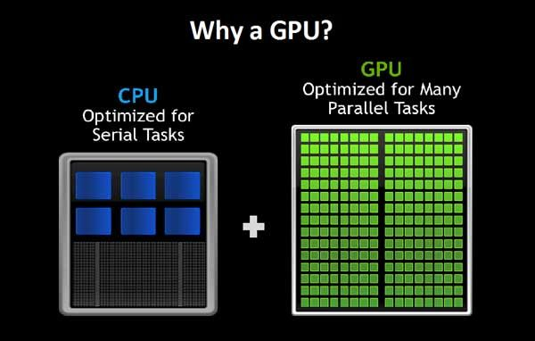

# What Is a GPU?

## 1. What Does a GPU Do?

GPU (Graphics Processing Unit), đã trở thành một phần quan trọng trong công nghệ điện toán cho cá nhân và kinh tế số. Được thiết kế để xử lý song song, GPU được sử dụng cho các ứng dụng như xử lý đồ họa, trích xuất video. 
Mọi người thường biết đến GPU với khả năng tối ưu và hỗ trợ đồ họa cho Game. Nhưng hiện nay GPU trở nên phổ biến hơn với việc sử dụng để sáng tạo nội dung (video, hình ảnh) và xu thế hiện nay là Trí tuệ nhân tạo (AI - Artical Intelligence). 

GPU ban đầu chỉ được thiết kết với mục đích tối ưu xử lý đồ họa 3D. Nhưng qua thời gian, GPU trở nên linh hoạt hơn và có thể lập trình, và được cải thiện nhiều về tính năng. Việc này cho phép các lập trình viên đồ họa có thể xây dựng các hiệu ứng hình ảnh thú vị và thực tế hơn với các kỹ thuật nâng cao cho ánh sáng và bóng râm. 
Các Developer đang bắt đầu khai thác năng lực của GPU để tăng tốc các workload trong Tính toán hiệu năng cao ( HPC - High Performance computing ), Deep Learning, ...

2 thập kỉ trước, GPU được sử dụng chính cho tối ưu ứng dụng 3D real-time, như game. Nhưng hiện nay, các nhà khoa học máy tính nhận ra GPU có tiềm năng giải quyết các vấn đề tính toán khó khăn nhất thế giới.

## 2. GPU and CPU: Working Together

GPU và CPU có nhiều điểm chung. Cả hai đều là thành phần tính toán quan trọng, là bộ vi xử lý và đều có khả năng xử lý dữ liệu. Nhưng CPU và GPU lại có kiến trúc và được xây dựng dựa trên mục đích khác nhau.

| | |
|-|-|
|__CPU__| __GPU__ |
| Central Processing Unit | Graphics Processing Unit |
| Several cores | Several cores|
| Low latency | High throughput |
| Good for serial processing | Good for parallel processing |
| Can do a handful of operations at once | Can do thousands of operations at once|

- CPU: Được thiết kế để xử lý đa năng nhiều *loại* tác vụ nhanh chóng (được đo bằng CPU clock speed), nhưng lại bị giới hạn vì các tác vụ phải xử lý lần lượt. CPU chỉ bao gồm một vài lõi với nhiều bộ nhớ đệm có thể xử lý một vài luồng phần mềm cùng một lúc.

- GPU: Khác với CPU, GPU có thể thực thi song song nhiều bộ dữ liệu đẩy vào, được thiết kế với hàng ngàn lõi chạy đồng thời làm cho việc tính toán hiệu quả.

## 3. GPU vs. Graphics Card: What’s the Difference?
Khi mà khái niệm GPU và card đồ họa thường được sử dụng để thay thế cho nhau, nhung vẫn có sự phân biệt tinh tế giữa các khái niệm này.
Giống như bo mạch chủ chứa GPU. Card đồ họa bao gồm cả một bảng bổ trợ kết hợp GPU, bảng này bao gồm các mạch cho phép GPU hoạt động và kết nối tới các phần còn lại của hệ thống.

GPU có 2 dạng cơ bản: integrated và discrete.
- Intergrated GPU không được tách ra thành một card mà thay vào đó là được nhúng, hàn liền vào bo mạch vùng CPU. 
- Discrete GPU là một chip riêng biệt được gắn trên bảng mạch riêng và được lắp vào bảng mạch CPU thông qua PCIe. 

---
## 
[1]. https://www.intel.vn/content/www/vn/vi/products/docs/processors/what-is-a-gpu.html

[2]. https://blogs.nvidia.com/blog/2009/12/16/whats-the-difference-between-a-cpu-and-a-gpu/

[3]. https://www.intel.vn/content/www/vn/vi/products/docs/processors/cpu-vs-gpu.html

[4]. https://www.thegioimaychu.vn/tin-tuc/giong-va-khac-nhau-giua-gpu-va-cpu.html

[5]. https://www.omnisci.com/technical-glossary/cpu-vs-gpu