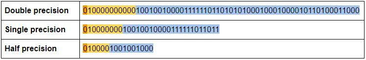

# GPU specifications

## 1. FLOPS

FLOPS là viết tắt của floating point operations per second, số phép tính số phẩy động trong một giây, TFLOPS được hiểu là “thực hiện bao nhiêu nghìn tỷ phép tính trong một giây”

Để các phép đo là chính xác và đồng đều thì người ta có tạo ra nhiều chuẩn số phẩy động khác nhau như độ chính xác một nửa (half-precision), độ chính xác đơn (single precision) và độ chính xác kép (double precision)

### 1.1 Difference Between Single-Precision, Double-Precision and Half-Precision Floating-Point Format 
Theo chuẩn IEEE cho toán học Floating-Point (Số phẩy động) là quy ước phổ biến để đại diện cho các số nhị phân trên máy tính. 
- Double-Precision format: mỗi số chiếm đến 64 bits
- Single-Precision format: sử dụng 32 bits
- Half-Precision format: chỉ dùng 16 bits

Để biết được cách hoạt động, ta sẽ lấy số *pi* làm ví dụ. Thông thường, số *pi* thường được viết 3.14 x 10 mũ 0. Nhưng máy tính lưu trữ số đó dưới dạng nhị phân floating-point, một chuỗi số 0 và 1 được đại diện cho số đó và số mũ tương ứng của nó

- Trong định dạng *single-precision* (32-bit format), một bit (signed bit) được sử dụng để xác định số đó là số âm hay số dương. 8 bit được dành riêng cho số mũ (vì nó là số nhị phân) được nâng lên 2 thành lũy thừa. 23 bits còn lại được sử dụng để đại diện cho các chữ ố tạo nên số đó (significand)

- *Double-precision* dành 11 bits cho số mũ và 52 bits cho số đại diện, mở rộng đáng kể phạm vi và kích thước của số mà nó có thể biểu diễn.

- *Half-precision* chiếm phần rất nhỏ, chỉ 5 bits cho số mũ vào 10 bits cho số đại diện

Đây là số *pi* sau khi được biểu diễn bằng floating-point

### 1.2 Difference Between Multi-Precision and Mixed-Precision Computing

- Multi-precision computing là sử dụng bộ xử lý có khả tính toán ở các cấp độ chính xác khác nhau - Sử dụng double-precision khi cần thiết và đẩy định dạng half-precision và single-precision cho phần khác của ứng dụng. (Tức là sẽ có mức độ ưu tiên)

- Mixed-Precision còn được biết đến là transprecision (tính toán xen kẽ - khó dịch quá), khi tính toán sẽ dùng các precision khác nhau cho một thao tác duy nhất để đạt được hiệu quả tính toán mà không ảnh hưởng đến độ chính xác. (Tức là khi một tác vụ cần xử lý, sẽ sử dụng hỗn hợp 3 precision để tính toán và đưa được ra kết quả chính xác và nhanh nhất)

NVIDIA Tensor Cores cho phép kích hoạt Mixed-Precision computing, linh hoạt điều chỉnh các phép tính để cải thiện throughput nhưng vẫn đảm bảo độ chính xác

