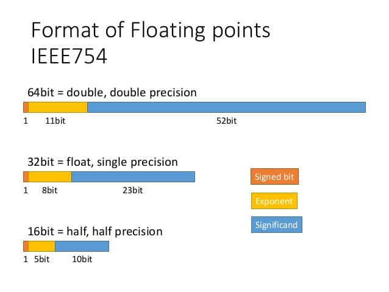

# GPU specifications

## 1. FLOPS

FLOPS là viết tắt của floating point operations per second, số phép tính số phẩy động trong một giây, TFLOPS được hiểu là “thực hiện bao nhiêu nghìn tỷ phép tính trong một giây”

Để các phép đo là chính xác và đồng đều thì người ta có tạo ra nhiều chuẩn số phẩy động khác nhau như độ chính xác một nửa (half-precision), độ chính xác đơn (single precision) và độ chính xác kép (double precision)

### 1.1 Difference Between Single-Precision, Double-Precision and Half-Precision Floating-Point Format 
Theo chuẩn IEEE cho toán học Floating-Point (Số phẩy động) là quy ước phổ biến để đại diện cho các số nhị phân trên máy tính. 
- Double-Precision format: mỗi số chiếm đến 64 bits
- Single-Precision format: sử dụng 32 bits
- Half-Precision format: chỉ dùng 16 bits

Để biết được cách hoạt động, ta sẽ lấy số *pi* làm ví dụ. Thông thường, số *pi* thường được viết 3.14 x 10 mũ 0. Nhưng máy tính lưu trữ số đó dưới dạng nhị phân floating-point, một chuỗi số 0 và 1 được đại diện cho số đó và số mũ tương ứng của nó

- Trong định dạng *single-precision* (32-bit format), một bit (signed bit) được sử dụng để xác định số đó là số âm hay số dương. 8 bit được dành riêng cho số mũ (vì nó là số nhị phân) được nâng lên 2 thành lũy thừa. 23 bits còn lại được sử dụng để đại diện cho các chữ ố tạo nên số đó (significand)

- *Double-precision* dành 11 bits cho số mũ và 52 bits cho số đại diện, mở rộng đáng kể phạm vi và kích thước của số mà nó có thể biểu diễn.

- *Half-precision* chiếm phần rất nhỏ, chỉ 5 bits cho số mũ vào 10 bits cho số đại diện

Đây là số *pi* sau khi được biểu diễn bằng floating-point

### 1.2 Difference Between Multi-Precision and Mixed-Precision Computing

- Multi-precision computing là sử dụng bộ xử lý có khả tính toán ở các cấp độ chính xác khác nhau - Sử dụng double-precision khi cần thiết và đẩy định dạng half-precision và single-precision cho phần khác của ứng dụng. (Tức là sẽ có mức độ ưu tiên)

- Mixed-Precision còn được biết đến là transprecision (tính toán xen kẽ - khó dịch quá), khi tính toán sẽ dùng các precision khác nhau cho một thao tác duy nhất để đạt được hiệu quả tính toán mà không ảnh hưởng đến độ chính xác. (Tức là khi một tác vụ cần xử lý, sẽ sử dụng hỗn hợp 3 precision để tính toán và đưa được ra kết quả chính xác và nhanh nhất)

Công nghệ mới NVIDIA Tensor Cores cho phép kích hoạt Mixed-Precision computing, linh hoạt điều chỉnh các phép tính để cải thiện throughput nhưng vẫn đảm bảo độ chính xác

## 2.  GPU Memory Performance

Các ứng dụng chuyên sâu về tính toán yêu cầu các thành phần tính toán trong GPU phải có hiệu năng cao, nhưng cùng đó là có thể truy xuất dữ liệu nhanh. Nhiều ứng dụng HPC, việc cải thiện khả năng tính toán không có tác dụng nếu không cải thiện cả hiệu năng Memory. Là khả năng truyền tải dữ liệu của bộ nhớ. Đây còn được hiểu là băng thông giữa bộ nhớ của VGA và GPU. Chỉ số này phụ thuộc vào xung của bộ nhớ và Bus bộ nhớ. Chú ý rằng bandwith không phụ thuộc vào dung lượng RAM trên card màn hình. Chỉ số này càng cao càng tốt.

## 3. GPU Memory Quantity

Thông số card đồ hoạ này cho biết dung lượng bộ nhớ ram (VRAM - Video Random Access Memony) của card màn hình. Nó có chức năng giống như RAM của PC. Bộ nhớ Vram càng lớn thì card sẽ càng có nhiều chỗ trống để xử lý đồ họa, cho hiệu năng càng cao.

## 4. PCI-E vs NVLink – Device-to-Host and Device-to-Device Throughput
Một trong những nút thắt cổ chai tiềm ẩn lớn nhất là chờ dữ liệu được truyền sang GPU. Sự tắc nghẽn bổ sung xuất hiện khi nhiều GPU hoạt động song song. Truyền dữ liệu nhanh hơn trực tiếp dẫn đến hiệu suất ứng dụng nhanh hơn. Các GPU GeForce kết nối qua PCI-Express, có thông lượng cao nhất trên lý thuyết là 16GB/s. Các GPU NVIDIA Tesla / Quadro với NVLink có thể tận dụng kết nối nhanh hơn nhiều. NVLink trong thế hệ “Pascal” của NVIDIA cho phép mỗi GPU giao tiếp với tốc độ lên đến 80GB/s (160GB/s hai chiều). NVLink 2.0 trong thế hệ “Volta” của NVIDIA cho phép mỗi GPU giao tiếp với tốc độ lên đến 150GB/s (300GB/s hai chiều). NVLink thế hệ thứ 3 trong thế hệ “Ampere” của NVIDIA cho phép mỗi GPU giao tiếp với tốc độ lên đến 300GB/s (600GB/s hai chiều). Kết nối NVLink được hỗ trợ giữa các GPU, giữa GPU và NVIDIA NVSwitch cũng như giữa CPU và GPU trên nền tảng OpenPOWER được hỗ trợ.

## 5. GPU Direct RDMA

Công nghệ GPU-Direct của NVIDIA cho phép cải thiện đáng kể tốc độ truyền dữ liệu giữa các GPU. Nhiều khả năng khác nhau nằm dưới ô GPU-Direct, nhưng khả năng RDMA hứa hẹn mức tăng hiệu suất lớn nhất. Theo truyền thống, việc gửi dữ liệu giữa các GPU của một cụm yêu cầu 3 bản sao bộ nhớ (một lần vào bộ nhớ hệ thống của GPU, một lần vào bộ nhớ hệ thống của CPU và một lần vào bộ nhớ của trình điều khiển InfiniBand). GPU Direct RDMA loại bỏ các bản sao bộ nhớ hệ thống, cho phép GPU gửi dữ liệu trực tiếp qua InfiniBand đến một hệ thống từ xa. Trên thực tế, điều này đã làm giảm đến 67% độ trễ và tăng 430% băng thông cho các kích thước bản tin MPI nhỏ [1]. Trong phiên bản CUDA 8.0, NVIDIA đã giới thiệu GPU Direct RDMA ASYNC, cho phép GPU bắt đầu truyền RDMA mà không cần bất kỳ tương tác nào với CPU.
