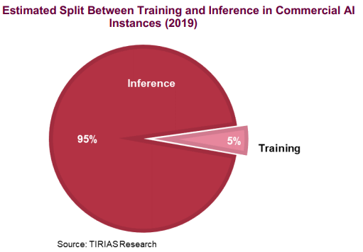

# GPU Workloads

Neutral network được đào tạo được đưa vào hoạt động trong thế giới kỹ thuật số bằng cách sử dụng những gì nó đã học được - để nhận dạng hình ảnh, lời nói, bệnh về máu hoặc gợi ý đôi giày mà ai đó có khả năng sẽ mua tiếp theo, bạn đặt tên cho nó - trong hình thức hợp lý của một ứng dụng. Phiên bản nhanh hơn và hiệu quả hơn của mạng nơ-ron này cung cấp những điều về dữ liệu mới mà nó được trình bày dựa trên quá trình đào tạo của nó. Trong từ điển AI, điều này được gọi là "suy luận".

*Inference là nơi các khả năng học được trong quá trình Deeplearning Training được đưa vào hoạt động.*

Inference không thể xảy ra nếu không có Training. Có ý nghĩa. Đó là cách chúng tôi thu thập và sử dụng phần lớn kiến thức của mình. Và cũng giống như việc chúng ta không mang theo tất cả giáo viên của mình, một vài giá sách quá tải, Inference không đòi hỏi tất cả cơ sở hạ tầng của chế độ Training để thực hiện tốt công việc của mình.

## Training Deep Neural Networks

Mặc dù mục tiêu là giống nhau - kiến ​​thức - quá trình giáo dục hoặc đào tạo, của một mạng neutral không hoàn toàn giống như mạng lưới của chúng ta. Mạng lưới thần kinh được mô hình hóa lỏng lẻo dựa trên đặc điểm sinh học của bộ não chúng ta - tất cả những liên kết giữa các tế bào thần kinh. Không giống như bộ não của chúng ta, nơi bất kỳ nơ-ron nào có thể kết nối với bất kỳ nơ-ron nào khác trong một khoảng cách vật lý nhất định, mạng nơ-ron nhân tạo có các lớp, kết nối và hướng truyền dữ liệu riêng biệt.

Khi huấn luyện mạng neutral, dữ liệu huấn luyện mẫu được đưa vào lớp đầu tiên của mạng và các neutral riêng lẻ ấn định trọng số cho đầu vào - mức độ đúng hay sai - dựa trên nhiệm vụ đang được thực hiện.

Trong mạng nhận dạng hình ảnh, lớp đầu tiên có thể tìm kiếm các cạnh. Tiếp theo có thể tìm cách các cạnh này tạo thành hình - hình chữ nhật hoặc hình tròn. Thứ ba có thể tìm kiếm các tính năng cụ thể - chẳng hạn như mắt sáng bóng và mũi nút. Mỗi lớp chuyển hình ảnh sang lớp tiếp theo, cho đến khi lớp cuối cùng và đầu ra cuối cùng được xác định bằng tổng tất cả các trọng số đó được tạo ra.

Giả sử nhiệm vụ là xác định hình ảnh của mèo. Mạng neutral nhận được tất cả các hình ảnh huấn luyện này, tính trọng số của nó và đưa ra kết luận là mèo hay không. Những gì nó nhận được trong phản hồi từ thuật toán đào tạo chỉ là “đúng” hoặc “sai”.

## Training 

Và nếu thuật toán thông báo cho mạng neutral rằng nó sai, nó sẽ không nhận được câu trả lời đúng là gì. Lỗi được lan truyền trở lại qua các lớp của mạng và nó phải đoán ở điều gì đó khác. Trong mỗi lần thử, nó phải xem xét các thuộc tính khác - trong ví dụ thuộc tính "mèo" - và cân nhắc các thuộc tính được kiểm tra ở mỗi lớp cao hơn hoặc thấp hơn. Sau đó, nó lại đoán. Và một lần nữa. Và một lần nữa. Cho đến khi nó có trọng số chính xác và nhận được câu trả lời chính xác thực tế mọi lúc. Nó là con mèo.

Bây giờ bạn có một cấu trúc dữ liệu và tất cả các trọng số trong đó đã được cân bằng dựa trên những gì nó đã học được khi bạn gửi dữ liệu đào tạo qua. Đó là một thứ đẹp đẽ được tinh chỉnh. Vấn đề là, nó cũng là một con quái vật khi sử dụng máy tính. Andrew Ng, người đã mài giũa các kỹ năng AI của mình tại Google và Stanford và hiện là nhà khoa học chính tại Phòng thí nghiệm Thung lũng Silicon của Baidu, cho biết việc đào tạo một trong những mô hình nhận dạng giọng nói tiếng Trung của Baidu không chỉ yêu cầu bốn terabyte dữ liệu đào tạo mà còn cần 20 exaflop máy tính - đó là 20 tỷ tỷ phép toán - trong toàn bộ chu kỳ đào tạo. Hãy thử chạy trên điện thoại thông minh.

## Inference

Phần Inference của AI là việc triển khai mô hình mạng neutral đã được training để sử dụng trong thời gian thực (<10ms) hoặc gần thời gian thực (10ms đến 100ms) đánh giá dữ liệu mới (ví dụ: xác định xem một bức ảnh mới có phải là một con chó hay không). Bởi vì Inference là việc triển khai hoặc sử dụng thực tế mô hình mạng neutral, Nghiên cứu TIRIAS ước tính rằng 95% hoặc hơn tất cả dữ liệu AI hiện tại được xử lý đều thông qua xử lý Inference

Điều đó có nghĩa là tất cả chúng ta đều sử dụng Inference mọi lúc. Trợ lý kích hoạt bằng giọng nói trên điện thoại thông minh của bạn sử dụng Inference, cũng như các ứng dụng nhận dạng giọng nói, tìm kiếm hình ảnh và lọc spam của Google. Baidu cũng sử dụng Inference để nhận dạng giọng nói, phát hiện phần mềm độc hại và lọc thư rác. Tính năng nhận dạng hình ảnh của Facebook và các công cụ đề xuất của Amazon và Netflix đều dựa trên Inference.

Các hệ thống được training với GPU cho phép máy tính xác định các model và đối tượng. Sau khi training xong, các mạng được triển khai vào lĩnh vực “Inference” - phân loại dữ liệu để “suy ra” một kết quả. Ở đây, GPU - và khả năng tính toán song song của chúng - mang lại lợi ích, nơi chúng chạy hàng tỷ phép tính dựa trên mạng được training để xác định các mẫu hoặc đối tượng đã biết.

Bạn có thể thấy các mô hình và ứng dụng này sẽ trở nên thông minh hơn, nhanh hơn và chính xác hơn như thế nào. Việc training sẽ bớt rườm rà hơn, và Inference sẽ mang lại những ứng dụng mới cho mọi khía cạnh cuộc sống của chúng ta. Có vẻ như lời khuyên tương tự cũng áp dụng cho AI cũng như cho tuổi trẻ của chúng ta - don’t be a fool, stay in school. Inference awaits

